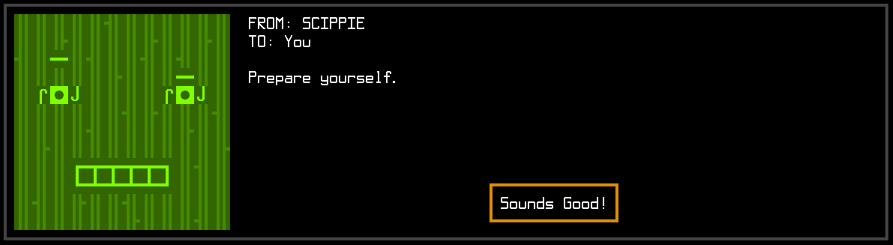
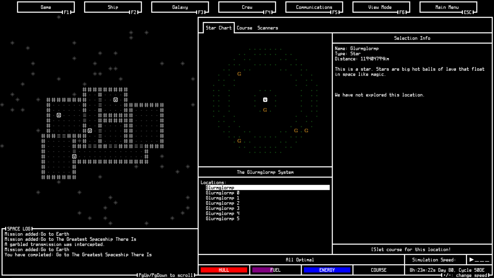

# Space Shippers

## A Game About a Space Ship!

You have stumbled upon Space Shippers, a roguelike-ish game about piloting a spaceship! Watch in amazement as your crew walks around a sleeps on the floor while you fly from planet to planet, doing nothing! It is truly a wonderful time to be alive.

More seriously, Space Shippers is a spaceship simulation game wherein (eventually) the player will have to traverse a ginormous procedurally generated galaxy in order to get home. Along the way the player will watch their ship and crew grow and evolve as the journey goes on. Just don't run out of fuel!

### WARNING: I'm currently porting Space Shippers to my new engine Tyumi, so it's not in a good place right now. Check back later!

Thanks so much for looking!

## Install

Just... don't. Not yet anyways! If you must, know that Space Shippers depends upon [go-sdl2](http://github.com/veandco/go-sdl2), which in turn depends upon having SDL2 installed. I'll put up some nice instructions soon, I promise.
